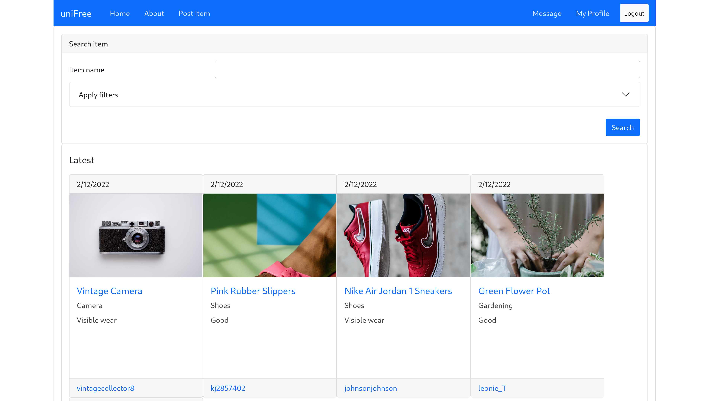
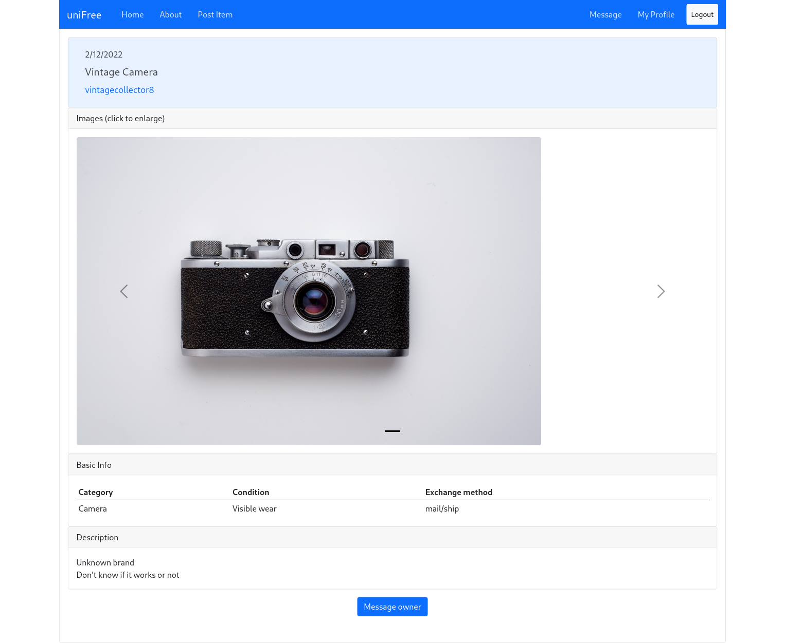
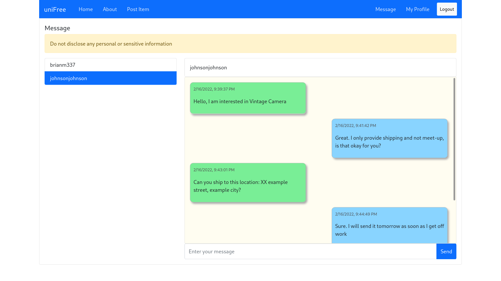

# uniFree (Frontend)



**Unfinished** demo project I created after finishing [FullStack Open](https://fullstackopen.com/en/). A free item exchanging/gifting platform made with React. Like a e-commerce site or ebay, but no price tags are attached to the items. I have since moved on to learning cyber security, **this project is no longer being developed or maintained**.

## What's unfinished?

- The "about" page - I simply don't know what to write, and how to make it look pretty
- Refactoring - Structure of the components can benefit from some reworking
- Responsive/mobile UI - Aren't as freshed out as the full width UI, some don't even have real responsiveness

**Everything else should work fine**

# Built with

- React
- Bootstrap
- Redux
- Socket.io

# Features

- Post Item
- Browse Item



- Live Chat with Item Owner



- View user profile
- User's trade history

# Requirements

1. [UniFree Backend](https://github.com/tera-si/unifree-backend)
2. Create a `.env` at the frontend root directory specifying the IP address the backend is running on. **Due to restrictions of socket.io, you cannot use localhost or loopback address (127.0.0.1), 192.168.x.x must be used instead**, afaik. The file must look like this:
```
REACT_APP_BACKEND_ADDRESS="192.168.x.x"
```

# Development

## `npm start`

Runs the app in the development mode.\
Open [http://localhost:3000](http://localhost:3000) to view it in the browser.

The page will reload if you make edits.\
You will also see any lint errors in the console.

**Due to restrictions of socket.io, if you use localhost:3000, live chat service will not funciton. You have to use full IP address instead, i.e. http://192.168.x.x:3000/**

## `npm test`

Launches the test runner in the interactive watch mode.\
See the section about [running tests](https://facebook.github.io/create-react-app/docs/running-tests) for more information.

# Build

## `npm run build`

Builds the app for production to the `build` folder.\
It correctly bundles React in production mode and optimizes the build for the best performance.

The build is minified and the filenames include the hashes.\
Your app is ready to be deployed!

See the section about [deployment](https://facebook.github.io/create-react-app/docs/deployment) for more information.

## `npm run eject`

**Note: this is a one-way operation. Once you `eject`, you can’t go back!**

If you aren’t satisfied with the build tool and configuration choices, you can `eject` at any time. This command will remove the single build dependency from your project.

Instead, it will copy all the configuration files and the transitive dependencies (webpack, Babel, ESLint, etc) right into your project so you have full control over them. All of the commands except `eject` will still work, but they will point to the copied scripts so you can tweak them. At this point you’re on your own.

You don’t have to ever use `eject`. The curated feature set is suitable for small and middle deployments, and you shouldn’t feel obligated to use this feature. However we understand that this tool wouldn’t be useful if you couldn’t customize it when you are ready for it.

